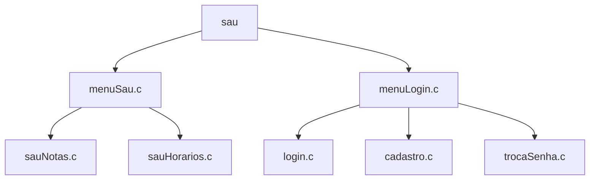

# Repositório das Aplicações do grupo 2 de Modular 22.2

## Componentes reutilizáveis
1. Sistema de Login

- login_basico: https://medium.com/@moinahmedbgbn/a-basic-login-system-with-python-746a64dc88d6
- login_interface: https://www.simplifiedpython.net/python-gui-login/

  1. Modelo

2. Sistema de busca

## Aplicações

1. Sistema de consulta universitária

2. Sistema de consulta de uma biblioteca

3. Sistema de aluguel de computadores

